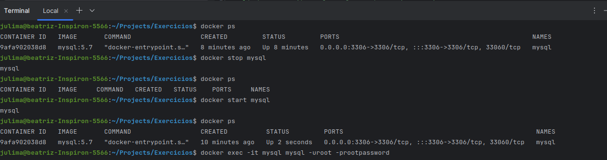

## Resolução da Lista de Exercícios

# 01: 
*Crie um arquivo Dockerfile que utilize a imagem alpine como base e imprima a mensagem Olá, Docker! ao ser executada. Construa a imagem com o nome meu-echo e execute um container a partir dela.*

Arquivo dockerfile:

```dockerfile
FROM alpine:3.21.3
CMD ["echo", "Olá Docker!"]
```

Construção da imagem:

```
docker build -t meu-echo .
```

Execução em um container:

```
docker run meu-echo
```


# 02: 
*Crie um container com Nginx que sirva uma página HTML customizada (index.html). Monte um volume local com esse arquivo para que ele apareça na raiz do site (/usr/share/nginx/html). Acesse a página via http://localhost.*

```
docker run -d -p 8080:80 --name site-nginx   
-v /home/julima/Projects/Exercicios/N02/index-2.html:/usr/share/nginx/html/index.html   
nginx:alpine
```


# 03:
*Inicie um container da imagem ubuntu com um terminal interativo (bash). Navegue pelo sistema de arquivos e instale o pacote curl utilizando apt.* 

```
docker run -it ubuntu bash
```


```
apt install curl -y
```


# 04:
*Suba um container do MySQL (pode usar a imagem mysql:5.7), utilizando um volume nomeado para armazenar os dados. Crie um banco de dados, pare o container, suba novamente e verifique se os dados persistem.*

```
docker volume create mysql_data
```


```
docker run -d \
  --name mysql \
  -e MYSQL_ROOT_PASSWORD=rootpassword \
  -v mysql_data:/var/lib/mysql \
  -p 3306:3306 \
  mysql:5.7
```


```
docker exec -it mysql mysql -uroot -prootpassword

CREATE DATABASE meubanco;
SHOW DATABASES;
```


Depois de criar meu banco de dados "meubanco", parei e iniciei o container. Foi verificado que os dados persistem.




# 05:
*Crie um container com a imagem alpine passando uma variável de ambiente chamada MEU_NOME com seu nome. Execute o container e imprima o valor da variável com o comando echo.*

```
docker run -it -e MEU_NOME=Juliana alpine sh
```


# 06:
*Utilize um multi-stage build para otimizar uma aplicação Go, reduzindo o tamanho da imagem final. Utilize para praticar o projeto GS PING desenvolvido em Golang.*

Os arquivos estão na pasta N06, após a criação dos arquivos, construí a imagem.

```
docker build -t app-go .
```


# 07:
*Crie um projeto no docker compose para executar o projeto React Express + Mongo* 

Os arquivos estão na pasta N07, é só clonar e rodar os containers:

```
docker-compose up --build
```

Acesse a aplicação:

Frontend (React): http://localhost:3000

Backend (Express): http://localhost:5000

# 08:
*Utilize Docker Compose para configurar uma aplicação com um banco de dados PostgreSQL, use para isso o projeto pgadmin.*


# 09:
*Construa uma imagem baseada no Nginx ou Apache, adicionando um site HTML/CSS estático. Utilize a landing page do Creative Tim para criar uma página moderna hospedada no container.*

Template que usei:
https://www.creative-tim.com/product/material-kit-react#

Instalar as dependências do react e após fazer o build:

```
rm -rf node_modules package-lock.json
npm install --legacy-peer-deps
npm run build
```

Construir a imagem e rodar o container:

```
docker build -t site-creative .
docker run -d -p 8080:80 site-creative
```

Acessar em:
http://localhost:8080


# 10:
*Ao rodar containers com o usuário root, você expõe seu sistema a riscos maiores em caso de comprometimento. Neste exercício, você deverá criar um Dockerfile para uma aplicação simples (como um script Python ou um servidor Node.js) e configurar a imagem para rodar com um usuário não-root.*

# 10a:
*Criar um usuário com useradd ou adduser no Dockerfile.*

```dockerfile
RUN useradd -r appuser
```

# 10b:
*Definir esse usuário como o padrão com a instrução USER.* 

```dockerfile
USER appuser
```

# 10c:
*Construir a imagem e iniciar o container.* 

```
docker build -t script-python .
docker run script-python
```

# 10d:
*Verificar se o processo está rodando com o novo usuário usando docker exec <container> whoami.*

Como criei um script simples, usei o run -it para verificar se estava sendo usado um usuário não-root.

```
docker run -it script-python sh
```


# 11:
*Trivy é uma ferramenta open source para análise de vulnerabilidades em imagens Docker. Neste exercício, você irá analisar uma imagem pública, como python:3.9 ou node:16, em busca de vulnerabilidades conhecidas.*

# 11e:
*Instalar o Trivy na sua máquina (via script ou pacote).* 

```
wget https://github.com/aquasecurity/trivy/releases/download/v0.17.2/trivy_0.17.2_Linux-64bit.deb
sudo dpkg -i trivy_0.17.2_Linux-64bit.deb
```

# 11f:
*Rodar trivy image <nome-da-imagem> para analisar.* 

```
trivy image python:3.9
```

# 11g:
*Identificar vulnerabilidades com severidade HIGH ou CRITICAL.*


# 11h:
*Anotar os pacotes ou bibliotecas afetadas e sugerir possíveis ações (como atualização da imagem base ou substituição de dependências).*

As 03 vulnerabilidades **HIGH** estão na Biblioteca "Setuptools(Metadata)".
**CVE-2022-40897   CVE-2024-6345   CVE-2025-47273**
Essas 03 CVEs estão ligadas ao processamento dos metadados dos pacotes Python. Metadados maliciosos podem colocar em risco o ambiente onde o pacote é instalado. 
O ideal é atualizar setuptools para a versão mais recente e evitar instalar pacotes de fontes não confiáveis. Como pode ser visto na imagem 11g, já estão disponível versões corrigidas desses pacotes.

# 12:
*Após identificar vulnerabilidades com ferramentas como o Trivy, o próximo passo é corrigi-las. Imagens grandes e genéricas frequentemente trazem bibliotecas desnecessárias e vulneráveis, além de usarem o usuário root por padrão. Neste exercício, você irá trabalhar com um exemplo de Dockerfile com más práticas e aplicar melhorias para construir uma imagem mais segura e enxuta. Identifique as melhorias e gere uma nova versão de Dockerfile.*


Nova versão com boas práticas está na pasta N12.  
Entre os itens modificados, adicionei um usuário não-root, usei uma imagem mais leve do python e uma versão atualizada do flask.


# 13:
*Crie um Dockerfile que use a imagem python:3.11-slim, copie um script Python local (app.py) e o execute com CMD. O script pode imprimir a data e hora atual.*


# 13a:
*Crie uma conta no Docker Hub.*


# 13b:
*Faça login pelo terminal com docker login.*


# 13c:
*Rebuild sua imagem meu-echo e a renomeie no formato seu-usuario/meu-echo:v1.*

```
docker build -t julianaaml/meu-echo:v1 .
```

# 13d:
*Faça o push da imagem para o Docker Hub.*

https://hub.docker.com/repository/docker/julianaaml/meu-echo/general