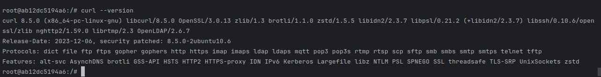

## Resolução da Lista de Exercícios

# 01: 
*Crie um arquivo Dockerfile que utilize a imagem alpine como base e imprima a mensagem Olá, Docker! ao ser executada. Construa a imagem com o nome meu-echo e execute um container a partir dela.*

Arquivo dockerfile

```dockerfile
FROM alpine:3.21.3
CMD ["echo", "Olá Docker!"]

```

Construção da imagem
```
docker build -t meu-echo .
```
Execução em um container
```
docker run meu-echo
```


# 02: 
*Crie um container com Nginx que sirva uma página HTML customizada (index.html). Monte um volume local com esse arquivo para que ele apareça na raiz do site (/usr/share/nginx/html). Acesse a página via http://localhost.*

```
docker run -d -p 8080:80 --name site-nginx   
-v /home/julima/Projects/Exercicios/N02/index-2.html:/usr/share/nginx/html/index.html   
nginx:alpine
```


# 03:
*Inicie um container da imagem ubuntu com um terminal interativo (bash). Navegue pelo sistema de arquivos e instale o pacote curl utilizando apt.* 

```
docker run -it ubuntu bash
```


```
apt install curl -y
```


# 04:
*Suba um container do MySQL (pode usar a imagem mysql:5.7), utilizando um volume nomeado para armazenar os dados. Crie um banco de dados, pare o container, suba novamente e verifique se os dados persistem.*

```
docker volume create mysql_data
```


```
docker run -d \
  --name mysql \
  -e MYSQL_ROOT_PASSWORD=rootpassword \
  -v mysql_data:/var/lib/mysql \
  -p 3306:3306 \
  mysql:5.7
```


```
docker exec -it mysql mysql -uroot -prootpassword

CREATE DATABASE meubanco;
SHOW DATABASES;
```


Depois de criar meu banco de dados "meubanco", parei e iniciei o container. Foi verificado que os dados persistem.


# 05:
*Crie um container com a imagem alpine passando uma variável de ambiente chamada MEU_NOME com seu nome. Execute o container e imprima o valor da variável com o comando echo.*

```
docker run -it -e MEU_NOME=Juliana alpine sh
```


# 06:
*Utilize um multi-stage build para otimizar uma aplicação Go, reduzindo o tamanho da imagem final. Utilize para praticar o projeto GS PING desenvolvido em Golang.*
