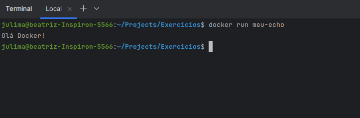

## Resolução da Lista de Exercícios

# 01: 
*Crie um arquivo Dockerfile que utilize a imagem alpine como base e imprima a mensagem Olá, Docker! ao ser executada. Construa a imagem com o nome meu-echo e execute um container a partir dela.*

Arquivo dockerfile

```dockerfile
FROM alpine:3.21.3
CMD ["echo", "Olá Docker!"]

```

Construção da imagem
```
docker build -t meu-echo .
```
Execução em um container
```
docker run meu-echo
```


# 02: 
*Crie um container com Nginx que sirva uma página HTML customizada (index.html). Monte um volume local com esse arquivo para que ele apareça na raiz do site (/usr/share/nginx/html). Acesse a página via http://localhost.*

```
docker run -d -p 8080:80 --name site-nginx   -v /home/julima/Projects/Exercicios/N02/index-2.html:/usr/share/nginx/html/index.html   nginx:alpine
```


